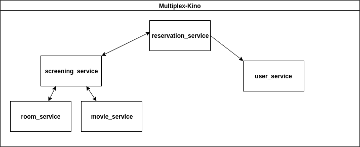

# Multiplex-Kino Protocol

## RPCs
### reservation_service
- CreateReservation (userID, screeningID, nrOfSteats) returns (reservationID) 
- ActivateReservation (reservationID) returns ()
- DeleteReservation (reservationID) returns ()
- DeleteReservationsWithScreening (screeningID) returns () | used by: screeningservice
- GetReservation (reservationID) returns (userID, screeningID, nrOfSeats, active)
- GetReservations () returns ()

### user_service
- CreateUser (name) returns (userID)
- DeleteUser (userID) returns () | used by: reservationservice
- GetUser (userID) returns (name) | used by: reservationservice
- GetUsers () returns () | used by: reservationservice
- AddUserReservation (userID, reservationID) returns () | used by: reservationservice
- DeleteUserReservation (userID, reservationID) returns () | used by: reservationservice

### screening_service
- CreateScreening (movieID,roomID) returns (screeningID)
- ChangeFreeSeats (screeningID,change) returns () | used by: reservationservice
- DeleteScreening (screeningID) returns () 
- DeleteScreeningsWithRoom (roomID) returns () | used by: roomservice
- DeleteScreeningsWithMovie (movieID) returns () | used by: movieservice
- GetScreening (screeningID) returns (movieID, roomID ,nrOfFreeSeats) | used by: reservationservice
- GetScreenings () returns ()

### movie_service
- CreateMovie(name) returns (movieID)
- DeleteMovie(movieID) returns ()
- GetMovie(movieID) returns (title) | used by: screeningservice
- GetMovies() returns ()

### room_service
- CreateRoom(name, nrOfSeats) returns (roomID)
- DeleteRoom(roomID) returns ()
- GetRoom(roomID) returns (name, roomID, nrOfSeats) | used by: screeningservice
- GetRooms() returns ()